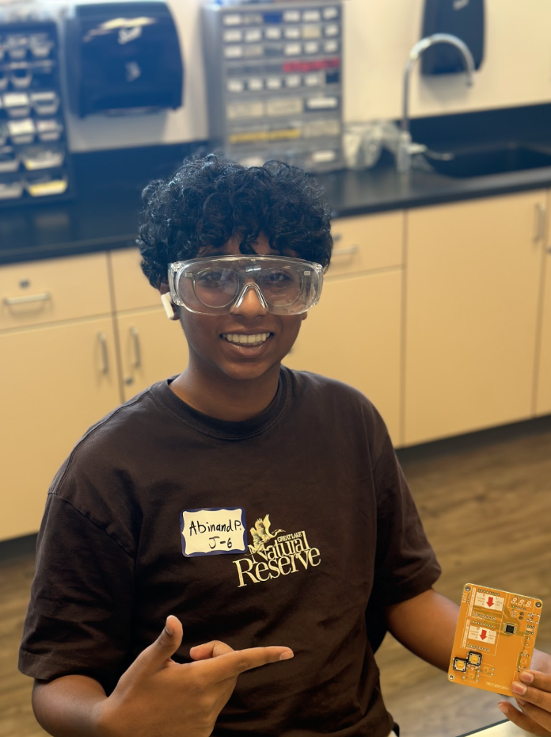
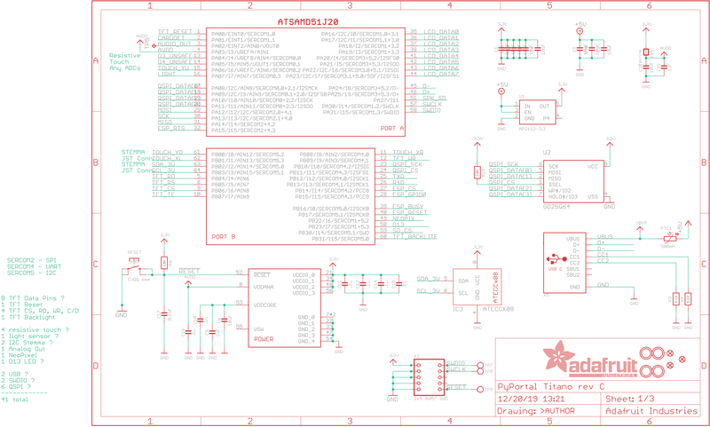
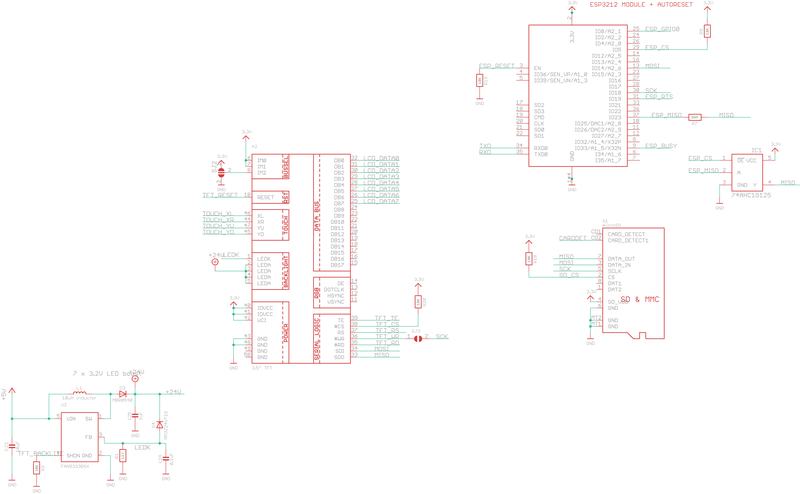
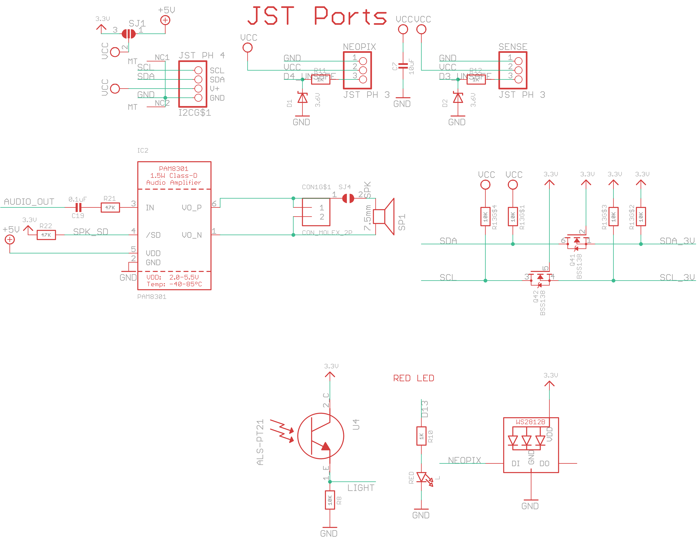
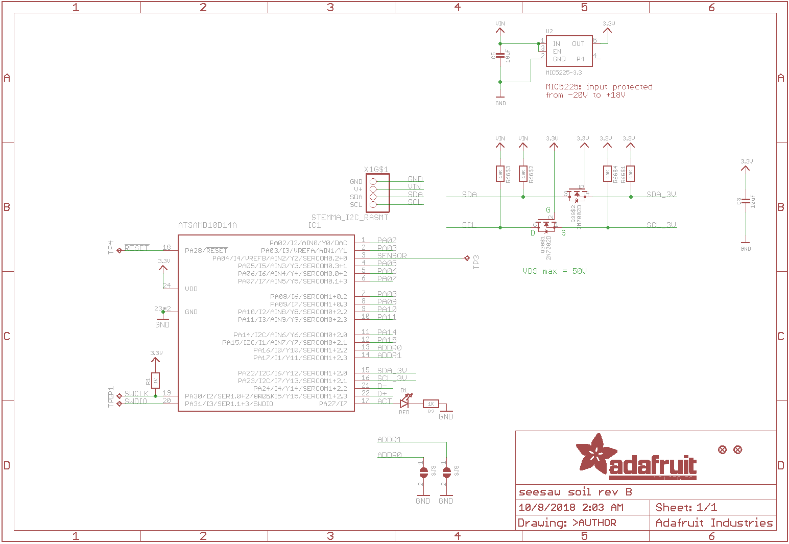
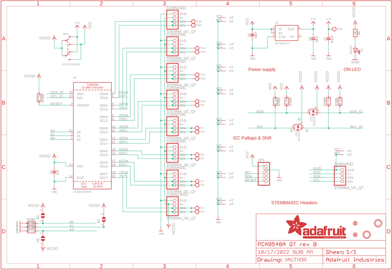
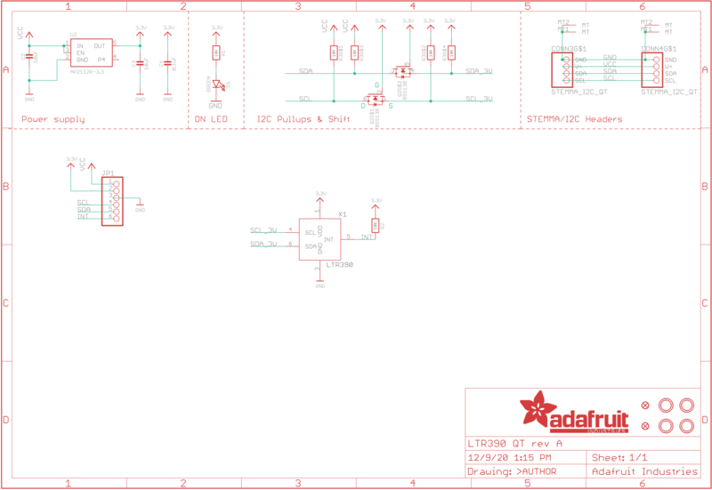
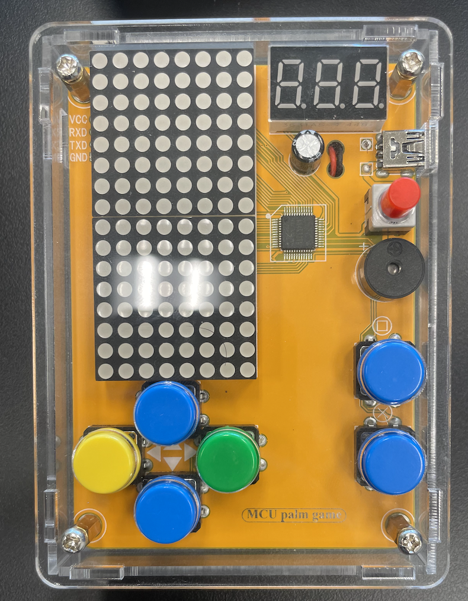

 # Interactive Pet Planter
The Interactive Pet Planter is an Adafruit-powered planter with temperature and water level gauges. The planter will alert the plant owner of low water levels or unfit temperature conditions via data sent to the owner's computer, as well as play audio alerts from the planter itself. The rig is custom-made out of 3D-printed parts, a PyPortal Titano, an Adafruit STEMMA Soil Sensor, an I2C 8-Channel Multiplexer, and a UV + Ambient Light Sensor.

| **Engineer** | **School** | **Area of Interest** | **Grade** |
|:--:|:--:|:--:|:--:|
| Abinand P. | Leland High School | Computer Science | Incoming Sophmore |
 


# Final Milestone
---
<iframe width="560" height="315" src="https://www.youtube.com/embed/X6F5kMFm5DI" title="Abinand P. Milestone 3" frameborder="0" allow="accelerometer; autoplay; clipboard-write; encrypted-media; gyroscope; picture-in-picture; web-share" allowfullscreen></iframe>
---

<h3>Summary</h3>
The final planter's design is complete, which mainly focuses on waterproofing but also features an external slot for the light sensor. I have added borders around the cable ports as well as the speaker hole, and completely closed off the open back, which previously exposed all of the electronics. I've also updated the display to display the UV and Ambient light readings around the plant. Thus, I've also added both of these data streams (UV and ambient light) to the Planter AI and can now provide further care steps based on these light readings. I have also implemented a clear plastic slide for the light sensor  so that the electronics won't be exposed to water or dirt when pouring them into the plant pot.

<h3>Challenges</h3>
When I originally ordered the light sensor and multiplexer (which allows multiple devices to be connected to the Titano at once), the plug-in ports were substantially smaller than the port on the PyPortal Titano. This meant I had to order a special type of wire that had a JST SH header and a JST PH header on the other end. Waiting for these parts to arrive slowed down the progress on the planter because the light sensor is essential in my modifications. The waterproofed planter frame that was 3D printed also had many warps and a crack, so I had to cut and trim a lot of these blemishes in order to fit everything nicely as well as keep the waterproof design.

<h3>Key Topics Learned</h3>
I expanded my knowledge of CAD significantly more. I was fluent with CAD prior to the program, but I learned many tools (e.g., thicken, external thread, mirror tools in Onshape) that aided in designing detailed improvements to the planter. I also became familiar with hardware; I did a lot of software work before the project, but all the Adafruit devices and having to learn new code that came with working these devices allowed me to expand my robotics knowledge to outside of software. I also acquired some designing skills on the Titano, which introduced a kind of tedious coordinate system that I needed to use to place my text and images in specific spots. I learned how to make a GitHub site and learned more about how to structure projects in GitHub. I was able to find an AI model that did  not require an API or Internet, which will greatly aid in future projects.

<h3>What I Hope to Learn in the Future</h3>
I hope to expand my knowledge of hardware to match the level of software I'm familiar with, and I believe Adafruit will be a good place to evolve from a beginner to an avid robot creator. Along with my CAD and AI creating skills, I hope to create more advanced robot projects, such as a humanoid robot. I've created a quadruped robot dog before, but now, combined with the software skills I learned and applied to this project, I know how to create more intricate and capable projects. BSE helped me diversify my skillset regarding robotics. The program set the foundation for much more growth, and with technology getting better, I will be able to create something that will bring weight to my accomplishments.

# Second Milestone
---
<iframe width="560" height="315" src="https://www.youtube.com/embed/of--iBlmlTE" title="Abinand P. Milestone 2" frameborder="0" allow="accelerometer; autoplay; clipboard-write; encrypted-media; gyroscope; picture-in-picture; web-share" allowfullscreen></iframe>
---
<h3>Summary</h3>
The planter's original design is complete, and all the necessary code for the display to function properly has been implemented. The Titano display features a water filling animation when the owner adds water to the pot. Located at the bottom of the screen, the temperature in Fahrenheit as well as the moisture level is displayed. A reading of around 350 means dehydrated (minimal moisture), and a reading of around 600 means very wet. I wanted something that would provide further aid in taking care of the plant, which is when I decided to implement an AI model to assist with this feat. The plant adviser AI runs in your code editor's terminal without the use of an API. This is achieved by sending the data from my Adafruit IO feeds (moisture and temperature) to the model. The model can then make suggestions based on the readings, such as steps to take care of your plant. An example use case would be asking if the moisture and temperature readings are normal for a specific plant (ex., Venus Flytrap). 

<h3>Challenges</h3>
A challenge I overcame was an attribute error with the PyPortal module, which was a problem with my CircuitPython itself. The PyPortal module is essential for sending the data to Adafruit IO, and I overcame this error by downgrading my CircuitPython version to a more stable release. There was also a period where I was stuck trying to find a model that was free and didn't require a paid API (used Ollama to avoid using an API entirely). 

<h3>Next Milestone Requirements</h3>
My final milestone includes modifications like waterproofing and an additional type of sensor. Unfortunately, the PyPortal Titano has only one I2C port for the soil sensor. Thus, I require a multiplexer and a light sensor (UV and Visible), as well as 3D-printing an enclosure for the planter to support outdoor use. After all this, I will be able to do my final milestone.

# First Milestone

<iframe width="560" height="315" src="https://www.youtube.com/embed/mPHPJ9TLLec" title="Abinand P. Milestone 1" frameborder="0" allow="accelerometer; autoplay; clipboard-write; encrypted-media; gyroscope; picture-in-picture; web-share" allowfullscreen></iframe>

<h3>Summary</h3>
The majority of the planter consists of 3D-printed parts. There is the frame, where the cup, drip tray, sensor plate, back cover, and screen cover are attached. The PyPortal Titano is attached to the screen cover, which will later be snap-fitted into the frame. The Adafruit STEMMA Soil Sensor is attached to the sensor plate and then to the cup (wires attached to Titano). Finally, the speaker is attached to the left wall of the frame, and the wires are attached to the Titano. I have started setting up the Internet access for the Pyportal Titano. 

<h3>Challenges</h3>
The challenge I'm facing is some technical issues in configuring the software included with the Titano. Some of the software was outdated with duplicate files, so I need to be careful before running code on the Titano in future milestones. I also downloaded Wippersnapper on the Titano, which wiped the CircuitPython from the board, and CircuitPython won't download again, even though I reset the whole board. I need to find a workaround to download CircuitPython again.

<h3>Next Milestone Requirements</h3>
The only things left to do with my project now are to set up the code for the Titano and then the Adafruit IO data display. After this (with sufficient time), I can link an AI model to interpret the data and tell if the plant is healthy or not, as well as provide plant care instructions.

# Schematics 
**PyPortal Titano**
---




<a href="https://learn.adafruit.com/adafruit-pyportal-titano/downloads"> PyPortal Titano Schematics Source</a>

**Soil Sensor**
---


<a href="https://learn.adafruit.com/assets/65928"> Soil Sensor Schematics Source</a>

**I2C Multiplexer**
---


<a href="https://www.adafruit.com/product/5626"> I2C Multiplexer Schematics Source</a>

**Light Sensor**
---


<a href="https://www.adafruit.com/product/4831"> Light Sensor Schematics Source</a>

# Code
<!-- Here's where you'll put your code. The syntax below places it into a block of code. Follow the guide [here]([url](https://www.markdownguide.org/extended-syntax/)) to learn how to customize it to your project needs. -->

<h3>Pet Planter Display and Adafruit IO Code</h3>
 
```python
############################################
# Pet Planter Display and Adafruit IO Code #
############################################

from os import getenv
import time

import board
import busio
from digitalio import DigitalInOut
import adafruit_connection_manager
from adafruit_esp32spi import adafruit_esp32spi, adafruit_esp32spi_wifimanager
import adafruit_imageload
import displayio
import neopixel
from adafruit_bitmap_font import bitmap_font
from adafruit_display_text.label import Label
from adafruit_io.adafruit_io import IO_MQTT
import adafruit_minimqtt.adafruit_minimqtt as MQTT
from adafruit_pyportal import PyPortal
from adafruit_seesaw.seesaw import Seesaw
from simpleio import map_range
import adafruit_tca9548a
import adafruit_ltr390

# Get WiFi details and Adafruit IO keys, ensure these are setup in settings.toml
# (visit io.adafruit.com if you need to create an account, or if you need your Adafruit IO key.)
ssid = getenv("CIRCUITPY_WIFI_SSID")
password = getenv("CIRCUITPY_WIFI_PASSWORD")
aio_username = getenv("ADAFRUIT_AIO_USERNAME")
aio_key = getenv("ADAFRUIT_AIO_KEY")

if None in [ssid, password, aio_username, aio_key]:
    raise RuntimeError(
        "WiFi and Adafruit IO settings are kept in settings.toml, "
        "please add them there. The settings file must contain "
        "'CIRCUITPY_WIFI_SSID', 'CIRCUITPY_WIFI_PASSWORD', "
        "'ADAFRUIT_AIO_USERNAME' and 'ADAFRUIT_AIO_KEY' at a minimum."
    )

#---| User Config |---------------

# How often to poll the soil sensor, in seconds
# Polling every 30 seconds or more may cause connection timeouts
DELAY_SENSOR = 0

# How often to send data to adafruit.io, in minutes
DELAY_PUBLISH = 1

# Maximum soil moisture measurement
SOIL_LEVEL_MAX = 1000

# Minimum soil moisture measurement
SOIL_LEVEL_MIN= 1

# Subtracted from read moisture level to display lower numbers (dry moisture is set high)
true_moisture = 0

#---| End User Config |---------------

# Background image
BACKGROUND = "/images/roots.bmp"
# Icons for water level and temperature
ICON_LEVEL = "/images/icon-wetness.bmp"
ICON_TEMP = "/images/icon-temp.bmp"
WATER_COLOR = 0x16549E

# Audio files
#wav_water_high = "/sounds/water-high.wav"
#wav_water_low = "/sounds/water-low.wav"

# the current working directory (where this file is)
cwd = ("/"+__file__).rsplit('/', 1)[0]

# Set up i2c bus
i2c_bus = busio.I2C(board.SCL, board.SDA)

# Create the TCA9548A object (multiplexer) and give it the I2C bus
tca = adafruit_tca9548a.TCA9548A(i2c_bus)

# Initialize soil sensor (s.s)
ss = Seesaw(tca[1], addr=0x36)

# Initialize light sensor
ltr = adafruit_ltr390.LTR390(tca[0])

# PyPortal ESP32 AirLift Pins
esp32_cs = DigitalInOut(board.ESP_CS)
esp32_ready = DigitalInOut(board.ESP_BUSY)
esp32_reset = DigitalInOut(board.ESP_RESET)

spi = busio.SPI(board.SCK, board.MOSI, board.MISO)
esp = adafruit_esp32spi.ESP_SPIcontrol(spi, esp32_cs, esp32_ready, esp32_reset)
status_pixel = neopixel.NeoPixel(board.NEOPIXEL, 1, brightness=0.9)
wifi = adafruit_esp32spi_wifimanager.WiFiManager(esp, ssid, password, status_pixel=status_pixel)

# Initialize PyPortal Display
display = board.DISPLAY

WIDTH = board.DISPLAY.width
HEIGHT = board.DISPLAY.height

# Initialize new PyPortal object
pyportal = PyPortal(esp=esp,
                    external_spi=spi)

# Set backlight level
pyportal.set_backlight(0.9)

# Create a new DisplayIO group
splash = displayio.Group()

# show splash group
display.root_group = splash

# Palette for water bitmap
palette = displayio.Palette(2)
palette[0] = 0x000000
palette[1] = WATER_COLOR
palette.make_transparent(0)

# Create water bitmap
water_bmp = displayio.Bitmap(display.width, display.height, len(palette))
water = displayio.TileGrid(water_bmp, pixel_shader=palette)
splash.append(water)

print("drawing background..")
# Load background image
try:
    bg_bitmap, bg_palette = adafruit_imageload.load(BACKGROUND,
                                                    bitmap=displayio.Bitmap,
                                                    palette=displayio.Palette)
# Or just use solid color
except (OSError, TypeError):
    BACKGROUND = BACKGROUND if isinstance(BACKGROUND, int) else 0x000000
    bg_bitmap = displayio.Bitmap(display.width, display.height, 1)
    bg_palette = displayio.Palette(1)
    bg_palette[0] = BACKGROUND
bg_palette.make_transparent(0)
background = displayio.TileGrid(bg_bitmap, pixel_shader=bg_palette)

# Add background to display
splash.append(background)

print('loading fonts...')
# Fonts within /fonts/ folder
font = cwd+"/fonts/GothamBlack-50.bdf"
font_small = cwd+"/fonts/GothamBlack-25.bdf"

# pylint: disable=syntax-error
data_glyphs = b'0123456789FC-* '
font = bitmap_font.load_font(font)
font.load_glyphs(data_glyphs)

font_small = bitmap_font.load_font(font_small)
full_glyphs = b'0123456789abcdefghijklmnopqrstuvwxyzABCDEFGHIJKLMNOPQRSTUVWXYZ-,.: '
font_small.load_glyphs(full_glyphs)

# Label to display Adafruit IO status
label_status = Label(font_small)
label_status.x = 305
label_status.y = 10
splash.append(label_status)

# Create a label to display the temperature
label_temp = Label(font)
label_temp.x = 35
label_temp.y = 300
splash.append(label_temp)

# Create a label to display the UV Light level
label_uv = Label(font_small)
label_uv.x = display.width - 100
label_uv.y = 200
splash.append(label_uv)

# Create a label to display the Ambient Light level
label_amb = Label(font_small)
label_amb.x = display.width - 160
label_amb.y = 160
splash.append(label_amb)

# Create a label to display the water level
label_level = Label(font)
label_level.x = display.width - 130
label_level.y = 300
splash.append(label_level)

print('loading icons...')
# Load temperature icon
icon_tmp_bitmap, icon_palette = adafruit_imageload.load(ICON_TEMP,
                                                        bitmap=displayio.Bitmap,
                                                        palette=displayio.Palette)
icon_palette.make_transparent(0)
icon_tmp_bitmap = displayio.TileGrid(icon_tmp_bitmap,
                                     pixel_shader=icon_palette,
                                     x=0, y=280)
splash.append(icon_tmp_bitmap)

# Load level icon
icon_lvl_bitmap, icon_palette = adafruit_imageload.load(ICON_LEVEL,
                                                        bitmap=displayio.Bitmap,
                                                        palette=displayio.Palette)
icon_palette.make_transparent(0)
icon_lvl_bitmap = displayio.TileGrid(icon_lvl_bitmap,
                                     pixel_shader=icon_palette,
                                     x=315, y=280)
splash.append(icon_lvl_bitmap)

# Connect to WiFi
label_status.text = "Connecting..."
while not esp.is_connected:
    try:
        wifi.connect()
    except (RuntimeError, ConnectionError) as e:
        print("could not connect to AP, retrying: ",e)
        wifi.reset()
        continue
print("Connected to WiFi!")

pool = adafruit_connection_manager.get_radio_socketpool(esp)
ssl_context = adafruit_connection_manager.get_radio_ssl_context(esp)

# Initialize a new MQTT Client object
mqtt_client = MQTT.MQTT(broker="io.adafruit.com",
                        username=aio_username,
                        password=aio_key,
                        socket_pool=pool,
                        ssl_context=ssl_context)

# Adafruit IO Callback Methods
# pylint: disable=unused-argument
def connected(client):
    # Connected function will be called when the client is connected to Adafruit IO.
    print('Connected to Adafruit IO!')

def subscribe(client, userdata, topic, granted_qos):
    # This method is called when the client subscribes to a new feed.
    print('Subscribed to {0} with QOS level {1}'.format(topic, granted_qos))

# pylint: disable=unused-argument
def disconnected(client):
    # Disconnected function will be called if the client disconnects
    # from the Adafruit IO MQTT broker.
    print("Disconnected from Adafruit IO!")

# Initialize an Adafruit IO MQTT Client
io = IO_MQTT(mqtt_client)

# Connect the callback methods defined above to the Adafruit IO MQTT Client
io.on_connect = connected
io.on_subscribe = subscribe
io.on_disconnect = disconnected

# Connect to Adafruit IO
print("Connecting to Adafruit IO...")
io.connect()
label_status.text = " "
print("Connected!")

fill_val = 0.0
def fill_water(fill_percent):
    """Fills the background water.
    :param float fill_percent: Percentage of the display to fill.

    """
    assert fill_percent <= 1.0, "Water fill value may not be > 100%"
    # pylint: disable=global-statement
    global fill_val

    if fill_val > fill_percent:
        for _y in range(int((board.DISPLAY.height-1) - ((board.DISPLAY.height-1)*fill_val)),
                        int((board.DISPLAY.height-1) - ((board.DISPLAY.height-1)*fill_percent))):
            for _x in range(1, board.DISPLAY.width-1):
                water_bmp[_x, _y] = 0
    else:
        for _y in range(board.DISPLAY.height-1,
                        (board.DISPLAY.height-1) - ((board.DISPLAY.height-1)*fill_percent), -1):
            for _x in range(1, board.DISPLAY.width-1):
                water_bmp[_x, _y] = 1
    fill_val = fill_percent

def display_temperature(temp_val, is_celsius=False):
    """Displays the temperature from the STEMMA soil sensor
    on the PyPortal Titano.
    :param float temp: Temperature value.
    :param bool is_celsius:

    """
    if not is_celsius:
        temp_val = (temp_val * 9 / 5) + 32 - 15
        #print('Temperature: %0.0fF'%temp_val)
        label_temp.text = '%0.0fF'%temp_val
        return int(temp_val)
    else:
        #print('Temperature: %0.0fC'%temp_val)
        label_temp.text = '%0.0fC'%temp_val
        return int(temp_val)
    
# initial reference time
initial = time.monotonic()
while True:
    # Explicitly pump the message loop
    # to keep the connection active
    try:
        io.loop()
    except (ValueError, RuntimeError, ConnectionError, OSError) as e:
        print("Failed to get data, retrying...\n", e)
        wifi.reset()
        continue
    now = time.monotonic()

    #print("reading soil sensor...")
    # Read capactive
    moisture = ss.moisture_read() - true_moisture
    label_level.text = str(moisture)

    # Read UV
    uv = ltr.uvs
    label_uv.text = "UV: " + str(uv)

    # Read Ambient
    ambient = ltr.light
    label_amb.text = "AMB: " + str(ambient)

    # Convert into percentage for filling the screen
    moisture_percentage = map_range(float(moisture), SOIL_LEVEL_MIN, SOIL_LEVEL_MAX, 0.0, 1.0)

    # Read temperature
    temp = ss.get_temp()
    temp = display_temperature(temp)

    # fill display
    #print("filling disp..")
    fill_water(moisture_percentage)
    #print("disp filled..")

    #print("temp: " + str(temp) + "  moisture: " + str(moisture))

    # Play water level alarms
    if moisture <= SOIL_LEVEL_MIN:
        #print("Playing low water level warning...")
        print("")
        #pyportal.play_file(wav_water_low)
    elif moisture >= SOIL_LEVEL_MAX:
        #print("Playing high water level warning...")
        print("")
        #pyportal.play_file(wav_water_high)


    if now - initial > (DELAY_PUBLISH * 60):
        try:
            print("Publishing data to Adafruit IO...")
            label_status.text = "Sending to IO..."
            io.publish("moisture", moisture)
            io.publish("temperature", temp)
            io.publish("uv", uv)
            io.publish("ambient", ambient)
            print("Published")
            label_status.text = "Data Sent!"
            

            # reset timer
            initial = now
        except (ValueError, RuntimeError, ConnectionError, OSError) as e:
            label_status.text = "ERROR!"
            print("Failed to get data, retrying...\n", e)
            wifi.reset()
    time.sleep(DELAY_SENSOR)


    # Print Light Sensor UV and Ambient Values
    #print("UV:", uv, "\t\tAmbient Light:", ambient)
    #print("UVI:", ltr.uvi, "\t\tLux:", ltr.lux)'
```

<h3>Pet Planter AI</h3>

```python
#######################
# Pet Planter AI Code #
#######################

import requests
import json

# URLs for Adafruit IO feeds
MOISTURE_FEED_URL = "https://io.adafruit.com/api/v2/abinandp/feeds/moisture/data?limit=1"
TEMPERATURE_FEED_URL = "https://io.adafruit.com/api/v2/abinandp/feeds/temperature/data?limit=1"
AMBIENT_LIGHT_FEED_URL = "https://io.adafruit.com/api/v2/abinandp/feeds/ambient/data?limit=1"
UV_LIGHT_FEED_URL = "https://io.adafruit.com/api/v2/abinandp/feeds/uv/data?limit=1"

def fetch_latest_feed_value(feed_url):
    """Fetch the latest value from an Adafruit IO feed."""
    try:
        response = requests.get(feed_url)
        response.raise_for_status()
        data = response.json()
        if isinstance(data, list) and len(data) > 0:
            return data[0]["value"], data[0]["created_at"]
        else:
            return None, None
    except Exception as e:
        print(f"Error fetching data from {feed_url}: {e}")
        return None, None

def get_latest_sensor_data():
    """Fetch the latest moisture, temperature, ambient light, and UV values."""
    moisture, moisture_time = fetch_latest_feed_value(MOISTURE_FEED_URL)
    temperature, temperature_time = fetch_latest_feed_value(TEMPERATURE_FEED_URL)
    ambient_light, ambient_time = fetch_latest_feed_value(AMBIENT_LIGHT_FEED_URL)
    uv_light, uv_time = fetch_latest_feed_value(UV_LIGHT_FEED_URL)
    return {
        "moisture": moisture,
        "moisture_time": moisture_time,
        "temperature": temperature,
        "temperature_time": temperature_time,
        "ambient_light": ambient_light,
        "ambient_time": ambient_time,
        "uv_light": uv_light,
        "uv_time": uv_time,
    }

def analyze_plant_health(sensor_data):
    """Analyze sensor data and return a health summary and care advice."""
    try:
        moisture = int(sensor_data["moisture"]) if sensor_data["moisture"] is not None else None
        temperature = int(sensor_data["temperature"]) if sensor_data["temperature"] is not None else None
        ambient_light = int(sensor_data["ambient_light"]) if sensor_data["ambient_light"] is not None else None
        uv_light = int(sensor_data["uv_light"]) if sensor_data["uv_light"] is not None else None
    except Exception:
        return "Sorry, I couldn't interpret the sensor data.", "Please check your sensor setup."

    # Updated thresholds based on your sensor
    moisture_advice = ""
    if moisture is None:
        moisture_advice = "Moisture data unavailable."
    elif moisture <= 50:
        moisture_advice = "Soil is dry. Water your plant! Get to at least 750 on the moisture scale."
    elif 750 <= moisture <= 950:
        moisture_advice = "Soil moisture is good. No need to water now. Keep it at 750-950 on the moisture scale."
    else:
        moisture_advice = "Soil is too wet. Hold off on watering. Keep it at 750-950 on the moisture scale."

    temperature_advice = ""
    if temperature is None:
        temperature_advice = "Temperature data unavailable."
    elif temperature < 60: 
        temperature_advice = "It's a bit cold for most houseplants. Consider moving to a warmer spot. (60-80°F)"
    elif 60 <= temperature <= 80:
        temperature_advice = "Temperature is ideal for most houseplants. (60-80°F)"
    else:
        temperature_advice = "It's quite warm. Make sure your plant isn't in direct sunlight for too long. (60-80°F)"

    ambient_light_advice = ""
    if ambient_light is None:
        ambient_light_advice = "Ambient light data unavailable."
    elif ambient_light < 1500:
        ambient_light_advice = "Light levels are low. Consider moving your plant closer to a window or adding a grow light. (1500-75000)"
    elif 1500 <= ambient_light <= 75000:
        ambient_light_advice = "Ambient light levels are ideal for most houseplants. (1500-75000)"
    else:
        ambient_light_advice = "Light levels are very high. Make sure your plant isn't getting too much direct sunlight. (1500-75000)"

    uv_light_advice = ""
    if uv_light is None:
        uv_light_advice = "UV light data unavailable."
    elif uv_light < 50:
        uv_light_advice = "UV levels are low. Your plant might benefit from more natural sunlight. (50-300)"
    elif 50 <= uv_light <= 300:
        uv_light_advice = "UV light levels are ideal for plant growth. (50-300)"
    else:
        uv_light_advice = "UV levels are very high. Consider providing some shade to protect your plant. (50-300)"

    summary = (
        f"Current soil moisture: {sensor_data['moisture']} (measured at {sensor_data['moisture_time']})\n\n"
        f"Current temperature: {sensor_data['temperature']}°F (measured at {sensor_data['temperature_time']})\n\n"
        f"Current ambient light: {sensor_data['ambient_light']} (measured at {sensor_data['ambient_time']})\n\n"
        f"Current UV light: {sensor_data['uv_light']} (measured at {sensor_data['uv_time']})\n\n"
        )
    advice = (
        f"Moisture advice: {moisture_advice}\n\n"
        f"Temperature advice: {temperature_advice}\n\n"
        f"Ambient light advice: {ambient_light_advice}\n\n"
        f"UV light advice: {uv_light_advice}"
        )
    return summary, advice

def ask_ollama(user_message, plant_summary="", plant_advice=""):
    """Ask Ollama for plant care advice using a smaller model."""
    try:
        context = ""
        if plant_summary and plant_advice:
            context = f"Here is the latest plant data:\n{plant_summary}\nAdvice: {plant_advice}\n"

        prompt = (
            f"You are a friendly plant care assistant. {context}"
            f"User: {user_message}\n"
            f"Respond as a helpful plant care expert in 2-3 sentences."
        )

        # Try different smaller models in order of preference
        models_to_try = [
            "llama3.2:latest",         # Your preferred model
            "llama3.2",  # Alternative naming
            "llama2:latest",    # Fallback
        ]
        
        for model in models_to_try:
            try:
                print(f"Trying model: {model}...")
                response = requests.post(
                    "http://localhost:11434/api/generate",
                    json={
                        "model": model,
                        "prompt": prompt,
                        "stream": False,
                        "options": {
                            "temperature": 0.7,
                            "num_predict": 150,  # Limit response length
                            "top_k": 40,
                            "top_p": 0.9
                        }
                    },
                    timeout=30  # Shorter timeout for faster response
                )
                
                if response.status_code == 200:
                    result = response.json()
                    return result.get('response', 'Sorry,  I could not generate a response.')
                elif response.status_code == 404:
                    print(f"Model {model} not found, trying next...")
                    continue
                else:
                    print(f"Error with {model}: {response.status_code}")
                    continue
                    
            except requests.exceptions.Timeout:
                print(f"Timeout with {model}, trying next...")
                continue
            except Exception as e:
                print(f"Error with {model}: {e}")
                continue
        
        return "Sorry, none of the available models could generate a response. Try downloading a model with 'ollama pull llama2:3b'"
            
    except requests.exceptions.ConnectionError:
        return "Error: Cannot connect to Ollama. Make sure Ollama is running (ollama serve)."
    except Exception as e:
        return f"Sorry, I couldn't get a response: {str(e)}"

def chat_loop():
    print("Welcome to your Plant Adviser!")
    print("Commands:")
    print("- 'status': Get your plant's health")
    print("- 'chat': Start chatting with AI about plant care")
    print("- 'quit': Exit the program")
    print("- 'back': Return to main menu")
    print("\nNote: For AI chat, make sure Ollama is running and you have a model downloaded.")

    while True:
        user_input = input("\nYou: ").strip().lower()

        if user_input in ["quit", "exit"]:
            print("Goodbye! Take care of your plant!")
            break

        elif user_input in ["status", "health", "how is my plant?", "how is my plant", "stats",]:
            sensor_data = get_latest_sensor_data()
            summary, advice = analyze_plant_health(sensor_data)
            print(f"\nPlant Adviser:\n{summary}\n{advice}\n")

        elif user_input in ["chat", "ai", "ollama"]:
            print("\n=== AI Plant Care Chat (Ollama) ===")
            print("You can now chat with AI about plant care!")
            print("Type 'back' to return to main menu, or 'quit' to exit.")

            # Get current plant data for context
            sensor_data = get_latest_sensor_data()
            summary, advice = analyze_plant_health(sensor_data)

            while True:
                chat_input = input("\nAI Chat: ").strip()

                if chat_input.lower() in ["back", "return", "exit"]:
                    print("Returning to main menu...")
                    break
                elif chat_input.lower() in ["quit"]:
                    print("Goodbye! Take care of your plant!")
                    exit()
                elif chat_input:
                    print("Thinking...")
                    response = ask_ollama(chat_input, summary, advice)
                    print(f"\nAI Assistant: {response}\n")
                else:
                    print("Please type something to chat with AI!")

        else:
            print("Plant Adviser: Available commands - 'status', 'back', 'chat', or 'quit'.")

if __name__ == "__main__":
    print("--------------------------------")
    print("- Plant Adviser with Ollama AI -")
    print("--------------------------------")
    print("To use AI chat:")
    print("1. Start Ollama server: ollama serve")
    print("2. In another terminal, run: ollama run llama3.2")
    print("3. Or download llama3.2: ollama pull llama3.2")
    print("4. Then run this script: python plantadviser_ollama.py")
    print("-" * 50)
    chat_loop()
```

# Bill of Materials
<!---Here's where you'll list the parts in your project. To add more rows, just copy and paste the example rows below.
Don't forget to place the link of where to buy each component inside the quotation marks in the corresponding row after href =. Follow the guide [here]([url](https://www.markdownguide.org/extended-syntax/)) to learn how to customize this to your project needs. --->

| **Part** | **Note** | **Price** | **Link** |
|:--:|:--:|:--:|:--:|
| PyPortal Titano | The screen displays the temperature and moisture on the planter, and features a water fill animation | $59.95 | <a href="https://www.adafruit.com/product/4444"> Link </a> |
| Black Nylon Machine Screw and Stand-off Set – M2.5 Thread | Screws in soil sensor | $16.95 | <a href="www.adafruit.com/product/3299"> Link </a> |
| 560 Pieces M3 x 4mm /6mm /8mm /10mm /12mm /16mm /20mm, Button Head Socket Cap Screws Bolts Washers Nuts Kit, 304 Stainless Steel | Screws in Pyportal Titano | $9.99 | <a href="https://www.amazon.com/HELIFOUNER-Screws-Washers-Kit-Stainless/dp/B0B6HXWV2B/"> Link </a> |
| 5V 1A (1000mA) USB port power supply - UL Listed | Power Supply to plug in the Interactive pet planter to an outlet | $5.95 | <a href="https://www.adafruit.com/product/501"> Link </a> |
| 1FT USB C Data Cable 10Gbps Transfer, USB C 3.1 Gen 2 to USB Cable, Type C Charger 3A | Used to connect power supply and pet planter, also used to transfer new code to Titano | $6.99 | <a href="https://www.amazon.com/LDLrui-MacBook-Samsung-Portable-Android/dp/B08W28GQ4P/"> Link </a> |
| Adafruit STEMMA Soil Sensor - I2C Capacitive Moisture Sensor | Used to measure moisture and temperature of the plant | $7.50 | <a href="https://www.adafruit.com/product/4026"> Link </a> |
| Adafruit LTR390 UV Light Sensor | Measures UV light and ambient light levels | $4.95 | <a href="https://www.adafruit.com/product/4831"> Link </a> |
| Adafruit PCA9548 8-Channel STEMMA QT / Qwiic I2C Multiplexer | Used to connect multiple I2C devices to a board with only one I2C port | $6.95 | <a href="https://www.adafruit.com/product/5626"> Link </a> |
| STEMMA QT / Qwiic JST SH 4-Pin Cable - 200mm | Used to connect light sensor to multiplexer | $1.25 | <a href="www.adafruit.com/product/4401"> Link </a> |
| 4-pin JST PH to JST SH Cable - STEMMA to QT / Qwiic - 200mm Quantity: 2 | Used to connect soil sensor to multiplexer and another used to connect multiplexer to the Titano | $0.95 | <a href="www.adafruit.com/product/4424"> Link </a> |


<!--- # Other Resources/Examples
One of the best parts about Github is that you can view how other people set up their own work. Here are some past BSE portfolios that are awesome examples. You can view how they set up their portfolio, and you can view their index.md files to understand how they implemented different portfolio components.
- [Example 1](https://trashytuber.github.io/YimingJiaBlueStamp/)
- [Example 2](https://sviatil0.github.io/Sviatoslav_BSE/)
- [Example 3](https://arneshkumar.github.io/arneshbluestamp/)

To watch the BSE tutorial on how to create a portfolio, click here. --->

# Starter Project: Retro Arcade Console

<iframe width="560" height="315" src="https://www.youtube.com/embed/SwvrSX8DR4A" title="Abinand P. Starter Project" frameborder="0" allow="accelerometer; autoplay; clipboard-write; encrypted-media; gyroscope; picture-in-picture; web-share" allowfullscreen></iframe>

<h3>Summary</h3>
My starter project before I started my intensive project at BlueStamp Engineering was the Retro Arcade Console. I took an interest in the console because of the familiarity I had with consoles, as well as being the most advanced starter project that BSE offered. I brought home the fundamentals and practices of soldering, specifically on PCB boards. 

<h3>Assembly</h3>
The Retro Arcade Console consists of two forms of power: a battery pack consisting of 3 AAA batteries, or via a mini USB port. The screen was made up of a dot matrix where specific dots lit up to create the game of Tetris. The console has 7 buttons in total, with 4 of the buttons controlling movement: left, right, faster movement down, and slower movement down. The two blue buttons on the side are for muting the speaker and rotating the Tetris block. The slim, red button is an on and off button. The speaker is directly below the on/off button and near the top of the console; the points earned are displayed. All of this is mounted on a PCB board, and the entire console is protected and enclosed by acrylic boards.



<a href="https://www.hackster.io/lewisdiy/build-your-own-game-console-kit-play-the-classic-games-5ca95f"> Retro Arcade Console Schematics Source</a>
